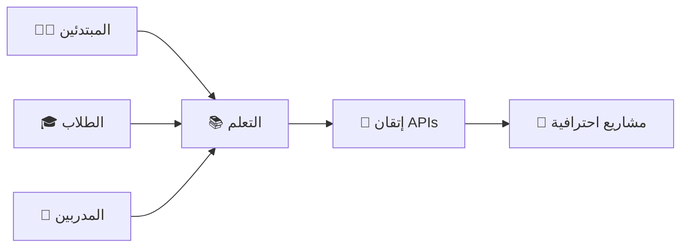
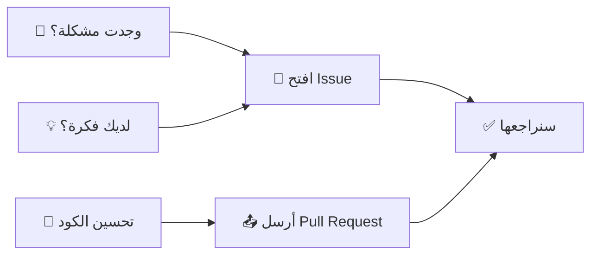

<div align="center">

# 📝 Todo List API

### REST API احترافي لإدارة المهام مع Express.js

[](https://nodejs.org/)
[](https://expressjs.com/)
[](https://javascript.com/)
[](https://postman.com/)
[](https://opensource.org/licenses/MIT)


[المميزات](#-المميزات) •
[البداية السريعة](#-البداية-السريعة) •
[التوثيق](#-التوثيق-الكامل) •
[أمثلة عملية](#-أمثلة-عملية)


</div>

---

## 📋 نظرة عامة

**Todo List API** هو مشروع تعليمي شامل يوفر بيئة مثالية لتعلم وممارسة تطوير واختبار RESTful APIs. هذا المشروع مصمم خصيصاً للمطورين الذين يريدون:

<div align="center">

| 🎓 التعلم | 🔧 الممارسة | 🚀 التطوير |
|---------|-----------|-----------|
| فهم معمارية REST | اختبار APIs بـ Postman | بناء مشاريع حقيقية |
| HTTP Methods الأساسية | التعامل مع JSON | إدارة البيانات |
| Status Codes | Error Handling | CRUD Operations |

</div>

## ✨ المميزات

<table>
<tr>
<td width="50%">

### 🎨 واجهة برمجية نظيفة
- ✅ Endpoints واضحة ومنظمة
- ✅ استجابات JSON موحدة
- ✅ رسائل خطأ مفهومة بالعربية
- ✅ CORS مفعّل للتطوير

</td>
<td width="50%">

### 🔥 مثالي للتعلم
- ✅ كود بسيط وواضح
- ✅ توثيق شامل بالعربية
- ✅ أمثلة عملية جاهزة
- ✅ سيناريوهات تدريبية

</td>
</tr>
<tr>
<td width="50%">

### 🛠️ سهل الاستخدام
- ✅ تثبيت سريع (دقيقة واحدة)
- ✅ بدون قواعد بيانات معقدة
- ✅ جاهز للعمل مباشرة
- ✅ متوافق مع جميع أدوات API

</td>
<td width="50%">

### 📚 موارد تعليمية
- ✅ شرح مفصل لكل endpoint
- ✅ أمثلة Postman & cURL
- ✅ تمارين عملية
- ✅ نصائح واحترافية

</td>
</tr>
</table>

<div align="center">

### 🎯 صُمم خصيصاً لـ:




</div>

## 🚀 البداية السريعة

<div align="center">

```ascii
╔══════════════════════════════════════╗
║   🎬 من الصفر إلى التشغيل في 60 ثانية   ║
╚══════════════════════════════════════╝
```

</div>

### 📦 المتطلبات

قبل البدء، تأكد من تثبيت:

<table>
<tr>
<td align="center" width="33%">

<br><b>Node.js</b>
<br>v14.0.0 أو أحدث
</td>
<td align="center" width="33%">

<br><b>npm</b>
<br>مدير الحزم
</td>
<td align="center" width="33%">

<br><b>Postman</b>
<br>(اختياري)
</td>
</tr>
</table>

### 🔧 التثبيت والتشغيل

```bash
# 1️⃣ استنسخ المشروع
git clone https://github.com/your-username/todo-api.git
cd todo-api

# 2️⃣ ثبّت الحزم المطلوبة
npm install

# 3️⃣ شغّل الخادم
npm start

# ✅ الخادم الآن يعمل على http://localhost:3000
```

<div align="center">

### 🎉 مبروك! المشروع جاهز


جرّب أول طلب:
```bash
curl http://localhost:3000
```

أو افتح المتصفح على: [`http://localhost:3000`](http://localhost:3000)

</div>

---

## 📖 التوثيق الكامل

### هيكل البيانات

كل مهمة (Todo) تحتوي على:

```javascript
{
  "id": 1,                                    // رقم تعريفي فريد
  "title": "تعلم Node.js",                    // عنوان المهمة (مطلوب)
  "description": "إنهاء كورس Node.js",        // وصف المهمة (اختياري)
  "completed": false,                         // حالة الإنجاز
  "createdAt": "2025-11-11T10:30:00.000Z",   // وقت الإنشاء
  "updatedAt": "2025-11-11T10:30:00.000Z"    // آخر تحديث
}
```

### قائمة Endpoints

| Method | Endpoint | الوصف | Status |
|--------|----------|-------|--------|
| GET | `/todos` | جلب جميع المهام | 200 |
| GET | `/todos/:id` | جلب مهمة محددة | 200, 404 |
| POST | `/todos` | إنشاء مهمة جديدة | 201, 400 |
| PUT | `/todos/:id` | تحديث مهمة موجودة | 200, 404 |
| DELETE | `/todos/:id` | حذف مهمة محددة | 200, 404 |
| DELETE | `/todos` | حذف جميع المهام | 200 |

---

## 📘 شرح تفصيلي

### 1. جلب جميع المهام

احصل على قائمة بجميع المهام المخزنة.

```http
GET /todos
```

**مثال الاستجابة:**
```json
{
  "success": true,
  "data": [
    {
      "id": 1,
      "title": "تعلم Node.js",
      "description": "إنهاء كورس Node.js",
      "completed": false,
      "createdAt": "2025-11-11T10:30:00.000Z",
      "updatedAt": "2025-11-11T10:30:00.000Z"
    }
  ],
  "count": 1
}
```

---

### 2. جلب مهمة محددة

احصل على تفاصيل مهمة واحدة باستخدام ID.

```http
GET /todos/:id
```

**مثال:**
```http
GET /todos/1
```

**استجابة ناجحة (200):**
```json
{
  "success": true,
  "data": {
    "id": 1,
    "title": "تعلم Node.js",
    "description": "إنهاء كورس Node.js",
    "completed": false,
    "createdAt": "2025-11-11T10:30:00.000Z",
    "updatedAt": "2025-11-11T10:30:00.000Z"
  }
}
```

**استجابة خطأ (404):**
```json
{
  "success": false,
  "message": "المهمة غير موجودة"
}
```

---

### 3. إنشاء مهمة جديدة

أنشئ مهمة جديدة في القائمة.

```http
POST /todos
Content-Type: application/json
```

**Body:**
```json
{
  "title": "تعلم Express.js",
  "description": "بناء REST API باستخدام Express"
}
```

> ⚠️ **ملاحظة:** `title` مطلوب، `description` اختياري

**استجابة ناجحة (201):**
```json
{
  "success": true,
  "message": "تم إنشاء المهمة بنجاح",
  "data": {
    "id": 2,
    "title": "تعلم Express.js",
    "description": "بناء REST API باستخدام Express",
    "completed": false,
    "createdAt": "2025-11-11T10:35:00.000Z",
    "updatedAt": "2025-11-11T10:35:00.000Z"
  }
}
```

**استجابة خطأ (400):**
```json
{
  "success": false,
  "message": "العنوان مطلوب"
}
```

---

### 4. تحديث مهمة

حدّث بيانات مهمة موجودة.

```http
PUT /todos/:id
Content-Type: application/json
```

**Body (يمكنك إرسال حقل واحد أو أكثر):**
```json
{
  "title": "تعلم Node.js - متقدم",
  "description": "دراسة المواضيع المتقدمة",
  "completed": true
}
```

**مثال - تحديث حالة المهمة فقط:**
```http
PUT /todos/1
Content-Type: application/json

{
  "completed": true
}
```

**استجابة ناجحة (200):**
```json
{
  "success": true,
  "message": "تم تحديث المهمة بنجاح",
  "data": {
    "id": 1,
    "title": "تعلم Node.js",
    "description": "إنهاء كورس Node.js",
    "completed": true,
    "createdAt": "2025-11-11T10:30:00.000Z",
    "updatedAt": "2025-11-11T11:00:00.000Z"
  }
}
```

---

### 5. حذف مهمة محددة

احذف مهمة محددة من القائمة.

```http
DELETE /todos/:id
```

**مثال:**
```http
DELETE /todos/1
```

**استجابة ناجحة (200):**
```json
{
  "success": true,
  "message": "تم حذف المهمة بنجاح",
  "data": {
    "id": 1,
    "title": "تعلم Node.js",
    "description": "إنهاء كورس Node.js",
    "completed": true,
    "createdAt": "2025-11-11T10:30:00.000Z",
    "updatedAt": "2025-11-11T11:00:00.000Z"
  }
}
```

---

### 6. حذف جميع المهام

احذف جميع المهام وأعد تعيين العدادات.

```http
DELETE /todos
```

> ⚠️ **تحذير:** هذا الإجراء لا يمكن التراجع عنه!

**استجابة ناجحة (200):**
```json
{
  "success": true,
  "message": "تم حذف 5 مهمة",
  "deletedCount": 5
}
```

---

## 🔥 أمثلة عملية

### 🎬 سيناريو كامل: إدارة قائمة مهامك اليومية

<details>
<summary><b>👉 انقر هنا لعرض السيناريو الكامل</b></summary>

<br>

#### 1️⃣ أنشئ مهمة جديدة

```bash
curl -X POST http://localhost:3000/todos \
  -H "Content-Type: application/json" \
  -d '{
    "title": "تعلم Node.js",
    "description": "مشاهدة دورة Node.js على يوتيوب"
  }'
```

#### 2️⃣ اجلب جميع المهام

```bash
curl http://localhost:3000/todos
```

#### 3️⃣ حدّث حالة المهمة (أكملتها!)

```bash
curl -X PUT http://localhost:3000/todos/1 \
  -H "Content-Type: application/json" \
  -d '{"completed": true}'
```

#### 4️⃣ احذف المهمة

```bash
curl -X DELETE http://localhost:3000/todos/1
```

</details>

<div align="center">

### 🎯 سيناريوهات تدريبية إضافية

<table>
<tr>
<td align="center" width="33%">

#### 📝 سيناريو 1
**قائمة تسوق**

أنشئ 5 عناصر للتسوق
ثم حدّث 3 منها كمكتملة

</td>
<td align="center" width="33%">

#### 📚 سيناريو 2
**خطة دراسية**

أنشئ مهام الدراسة
تتبع تقدمك اليومي
احذف ما أنهيته

</td>
<td align="center" width="33%">

#### 🎮 سيناريو 3
**اختبار الأخطاء**

جرّب IDs غير موجودة
أنشئ مهام بدون عنوان
اختبر جميع حالات الفشل

</td>
</tr>
</table>

</div>

---

## 🔧 استخدام Postman

<div align="center">


### دليلك الكامل لاختبار API باستخدام Postman

</div>

### 📥 استيراد Collection جاهز

<details>
<summary><b>📦 تحميل Postman Collection</b></summary>

<br>

احفظ هذا الملف كـ `todo-api.postman_collection.json`:

```json
{
  "info": {
    "name": "Todo List API",
    "description": "مجموعة كاملة لاختبار Todo API",
    "schema": "https://schema.getpostman.com/json/collection/v2.1.0/collection.json"
  },
  "item": [
    {
      "name": "Get All Todos",
      "request": {
        "method": "GET",
        "header": [],
        "url": {
          "raw": "{{baseUrl}}/todos",
          "host": ["{{baseUrl}}"],
          "path": ["todos"]
        }
      }
    },
    {
      "name": "Create Todo",
      "request": {
        "method": "POST",
        "header": [
          {
            "key": "Content-Type",
            "value": "application/json"
          }
        ],
        "body": {
          "mode": "raw",
          "raw": "{\n  \"title\": \"مهمة جديدة\",\n  \"description\": \"وصف المهمة\"\n}"
        },
        "url": {
          "raw": "{{baseUrl}}/todos",
          "host": ["{{baseUrl}}"],
          "path": ["todos"]
        }
      }
    },
    {
      "name": "Update Todo",
      "request": {
        "method": "PUT",
        "header": [
          {
            "key": "Content-Type",
            "value": "application/json"
          }
        ],
        "body": {
          "mode": "raw",
          "raw": "{\n  \"completed\": true\n}"
        },
        "url": {
          "raw": "{{baseUrl}}/todos/1",
          "host": ["{{baseUrl}}"],
          "path": ["todos", "1"]
        }
      }
    },
    {
      "name": "Delete Todo",
      "request": {
        "method": "DELETE",
        "header": [],
        "url": {
          "raw": "{{baseUrl}}/todos/1",
          "host": ["{{baseUrl}}"],
          "path": ["todos", "1"]
        }
      }
    }
  ],
  "variable": [
    {
      "key": "baseUrl",
      "value": "http://localhost:3000"
    }
  ]
}
```

</details>

### 🎓 خطوات الاستخدام

<table>
<tr>
<td width="50%">

#### ⚙️ الإعداد الأولي

1. افتح Postman
2. اضغط على **Import**
3. حمّل الملف أعلاه
4. سيتم إنشاء Collection كامل تلقائياً

</td>
<td width="50%">

#### 🧪 بدء الاختبار

1. اختر Request من القائمة
2. اضغط **Send**
3. شاهد النتائج في Response
4. جرّب تعديل البيانات

</td>
</tr>
</table>

### 💡 نصائح Postman احترافية

```javascript
// ✅ مثال: Test Script للتحقق التلقائي
pm.test("Status code is 200", function () {
    pm.response.to.have.status(200);
});

pm.test("Response has success field", function () {
    var jsonData = pm.response.json();
    pm.expect(jsonData.success).to.eql(true);
});

pm.test("Response time is less than 200ms", function () {
    pm.expect(pm.response.responseTime).to.be.below(200);
});
```

<div align="center">

### 🛠️ أدوات بديلة

<table>
<tr>
<td align="center" width="25%">

<br><b>Insomnia</b>
<br>بديل خفيف وسريع
</td>
<td align="center" width="25%">

<br><b>Thunder Client</b>
<br>إضافة VS Code
</td>
<td align="center" width="25%">

<br><b>cURL</b>
<br>من سطر الأوامر
</td>
<td align="center" width="25%">

<br><b>Axios</b>
<br>من JavaScript
</td>
</tr>
</table>

</div>

### مثال باستخدام cURL
```bash
# جلب جميع المهام
curl http://localhost:3000/todos

# إنشاء مهمة جديدة
curl -X POST http://localhost:3000/todos \
  -H "Content-Type: application/json" \
  -d '{"title":"مهمة جديدة","description":"وصف المهمة"}'

# تحديث مهمة
curl -X PUT http://localhost:3000/todos/1 \
  -H "Content-Type: application/json" \
  -d '{"completed":true}'

# حذف مهمة
curl -X DELETE http://localhost:3000/todos/1
```

---

## ⚠️ ملاحظات مهمة

<div align="center">

| ⚡ التخزين | 🔒 الأمان | 🌐 CORS | 🎯 الاستخدام |
|-----------|----------|---------|--------------|
| في الذاكرة فقط | بدون مصادقة | مفعّل للجميع | تعليمي فقط |
| يُحذف بإعادة التشغيل | مفتوح للجميع | تطوير محلي | غير مناسب للإنتاج |

</div>

> 💡 **نصيحة:** هذا API مصمم للتعلم والتدريب فقط. للاستخدام الحقيقي، أضف قاعدة بيانات ونظام مصادقة!

---

## 📚 موارد تعليمية إضافية

<div align="center">

### 🎓 تعلم المزيد

<table>
<tr>
<td align="center" width="25%">

<br><b><a href="https://restfulapi.net/">RESTful API</a></b>
<br>فهم معمارية REST
</td>
<td align="center" width="25%">

<br><b><a href="https://nodejs.org/docs">Node.js Docs</a></b>
<br>توثيق Node.js
</td>
<td align="center" width="25%">

<br><b><a href="https://expressjs.com/">Express.js</a></b>
<br>دليل Express.js
</td>
<td align="center" width="25%">

<br><b><a href="https://learning.postman.com/">Postman Learning</a></b>
<br>دورات Postman
</td>
</tr>
</table>

</div>

---

## 🎁 تمارين إضافية

<details>
<summary><b>💪 تحديات للمستوى المتقدم</b></summary>

<br>

### 🔥 تحديات التطوير

1. **أضف نظام المستخدمين**
   - أنشئ endpoint للتسجيل
   - أضف JWT authentication
   - ربط المهام بالمستخدمين

2. **أضف قاعدة بيانات**
   - استخدم MongoDB أو PostgreSQL
   - حافظ على البيانات بشكل دائم
   - أضف migrations

3. **حسّن الأداء**
   - أضف pagination للمهام
   - استخدم caching مع Redis
   - أضف rate limiting

4. **أضف مميزات جديدة**
   - أولويات للمهام (عالي، متوسط، منخفض)
   - تواريخ استحقاق
   - تصنيفات (categories)
   - مرفقات ملفات

### 🧪 تحديات الاختبار

1. استخدم Postman Collection Runner
2. اكتب automated tests
3. اختبر جميع حالات الفشل
4. قس response time
5. اختبر concurrent requests

</details>

---

## 🤝 المساهمة

نرحب بمساهماتك! إذا وجدت مشكلة أو لديك اقتراح:

<div align="center">



</div>

### خطوات المساهمة

1. Fork المشروع
2. أنشئ فرع جديد (`git checkout -b feature/amazing-feature`)
3. Commit التغييرات (`git commit -m 'Add amazing feature'`)
4. Push للفرع (`git push origin feature/amazing-feature`)
5. افتح Pull Request

---


## 👨‍💻 المطور

<div align="center">

**صنع بـ ❤️ للمجتمع العربي**

<a href="https://github.com/your-username">
  
</a>

<a href="https://linkedin.com/in/your-username">
  
</a>

### 🌟 إذا أعجبك المشروع، لا تنسى النجمة!


**Happy Coding! 🚀**


صُمم للتعلم | مصنوع بشغف | مفتوح المصدر

</div>


